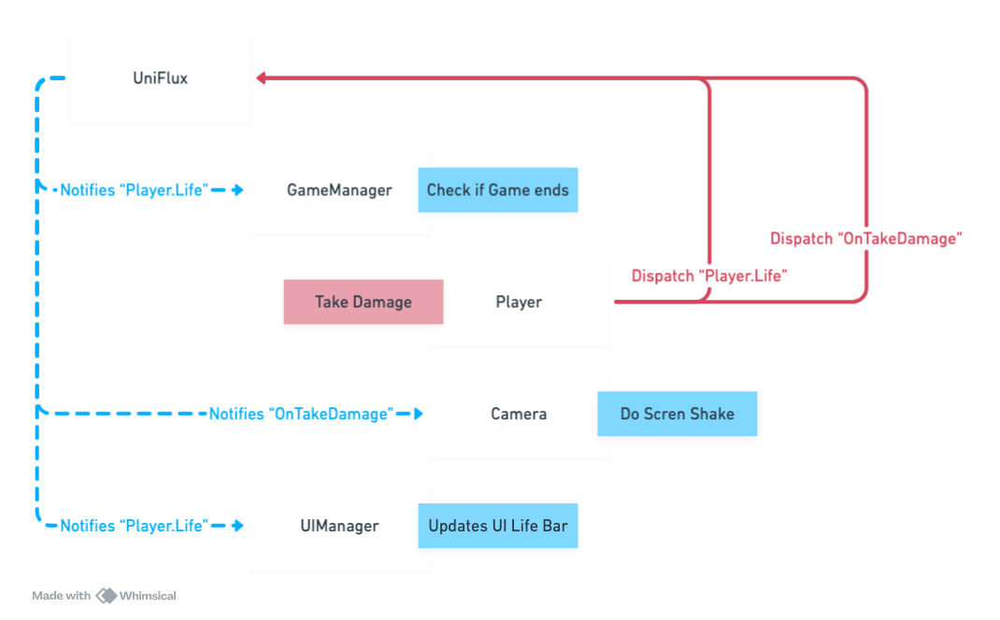

---
layout:
  title:
    visible: true
  description:
    visible: false
  tableOfContents:
    visible: true
  outline:
    visible: true
  pagination:
    visible: false
---

# What is UniFlux

UniFlux is an event and state management tool for game development in Unity. It allows developers to create simplified communication and status applications, allowing them to be accessed and updated from anywhere in the application. This can help simplify the code and make it easier to maintain.

Here some examples:

* Manage Player Status:  health, position, and score.
* Manage game state: current score, current level, and game state (e.g. paused, running, finished).
* Manage UI: visibility of UI elements and displayed text.

This can make it easier to access and update this information from anywhere in the game.

***

## How it works?

Based on how Flux Architecture works we Unified "Dispatcher", "Store" and "Action Creator"

<figure><figcaption>
From <a href="http://fluxxor.com/what-is-flux.html">http://fluxxor.com/what-is-flux.html</a>
</figcaption></figure>

But what does this imply? that all the complexity is hidden and you simply have to subscribe and send messages

<figure><figcaption></figcaption></figure>

Exist many ways to propagate states or messages, here a little example when a player takes damage.

<figure><figcaption></figcaption></figure>

Look, in this example you don't need to communicate directly to each others in any moment, your only dependencies are UniFlux and the keys you made it (in this example i use string as Keys, but you can also made your own key type instead of strings or ints)

Note: There are many ways to communicate, the important thing is that you can have flexibility and control without having many dependencies and references.
