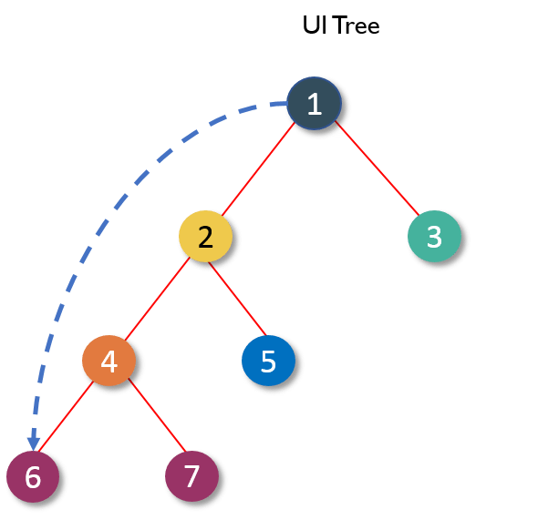

---
layout:
  title:
    visible: true
  description:
    visible: false
  tableOfContents:
    visible: true
  outline:
    visible: false
  pagination:
    visible: true
---

# Avoiding Prop Drilling

Prop Drilling is a problem that occurs when within a hierarchy a specific data must be passed from one point to another

<figure><figcaption><p>(1) Need to send a message to (6)</p></figcaption></figure>


```csharp
using UnityEngine;
using UnityEngine.UI;
public class GameManager : MonoBehaviour
{
    [SerializeField] private int playerScore = 100;
    [SerializeField] private UIManager uiManager;
    private void Start()
    {     
        uiManager.SetPlayerScore(playerScore);
    }
}
public class UIManager : MonoBehaviour
{
    [SerializeField] private UIPlayerScoreController uiPlayerScore;
    private void SetPlayerScore(int score)
    {     
        uiPlayerScore.SetScore = score;
    }
}
public class UIPlayerScoreController : MonoBehaviour
{
    [SerializeField] private Text text_score;
    private void SetScore(int score)
    {
        text_score.text = score.ToString();
    }
}
```


The problem with this approach is the implication of having to pass a piece of data through many methods and classes to complete its function.

Now let's do a test handling it with States:


```csharp
using UnityEngine;
using UnityEngine.UI;
using UniFlux;
public class GameManager : MonoBehaviour
{
    [SerializeField] private int playerScore = 100;
    private void Start()
    {     
        "PlayerScore".Dispatch(PlayerScore);
    }
}
public class UIManager : MonoBehaviour
{
    // Nothing here required.
}
public class UIPlayerScoreController : MonoFlux
{
    [SerializeField] private Text text_score;
    [StateFlux("PlayerScore")] private void SetScore(int state) 
    {
        text_score.text = score.ToString();
    }
}
```


Note that in this example UIManager is no longer required, and you can have fewer variables and dependencies. In this example we have used StateFlux instead of MethodFlux, this means that if another subscribed to the "PlayerScore" it would automatically take the last state without depending on all the information being sent to it again.
